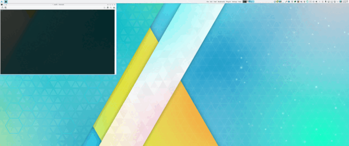

# Quick Tile Wide (quicktilewide)

Quick Tile Wide: Quick Tile for (ultra)wide monitors.

Quick Tile Wide allows to tile windows to sides and corners similar to Quick Tile, but places them in 3 columns instead of 2 columns. This is most useful when using (ultra)wide monitors.



## Default shortcuts

The default shortcuts are designed to be intuitive and easy to use. However, if the default shortcut scheme does not work for you (e.g. Wayland), or you want to extend or change it, you can change shortcuts as described below.

The screen is divided into 3 columns and 2 rows. And there are 2 simple rules to follow:

1) The NumPad keys (with Meta) correspond to the part of the screen where you want to move the active window to.

```
┌────────┬────────┬────────┐ ┌────────┬────────┬────────┐
│ Meta+7 │ Meta+8 │ Meta+9 │ │        │        │        │
├────────┼────────┼────────┤ │ Meta+4 │ Meta+5 │ Meta+6 │
│ Meta+1 │ Meta+2 │ Meta+3 │ │        │        │        │
└────────┴────────┴────────┘ └────────┴────────┴────────┘
```

2) Pressing Ctrl at the same time expands the window to the neighbor column(s).

```
┌─────────────────┬────────┐ ┌──────────────────────────┐ ┌────────┬─────────────────┐
│   Ctrl+Meta+7   │        │ │       Ctrl+Meta+8        │ │        │   Ctrl+Meta+9   │
├─────────────────┼────────┤ ├──────────────────────────┤ ├────────┼─────────────────┤
│   Ctrl+Meta+1   │        │ │       Ctrl+Meta+2        │ │        │   Ctrl+Meta+3   │
└─────────────────┴────────┘ └──────────────────────────┘ └────────┴─────────────────┘
┌─────────────────┬────────┐ ┌──────────────────────────┐ ┌────────┬─────────────────┐
│                 │        │ │                          │ │        │                 │
│   Ctrl+Meta+4   │        │ │       Ctrl+Meta+5        │ │        │   Ctrl+Meta+6   │
│                 │        │ │                          │ │        │                 │
└─────────────────┴────────┘ └──────────────────────────┘ └────────┴─────────────────┘
```

## How to change default shortcuts

Please search for "Quick Tile Wide" in KDE Settings > Keyboard > Shortcuts, and alter/add shortcuts according to your own preferences.

## Note to Wayland users

Due to a current (March 2024) bug in either KDE or Wayland, NumPad keys are not distinguished from regular keys under KDE Plasma+Wayland. For example, it does not distinguish between keys KP_1 (NumPad 1) and 1. So you cannot, for example, assign Meta+KP_1 key to tile a window, and have Meta+1 for something else. Moreover, for example, combination Shift+= is not distinguished from KP_Plus in KDE Plasma under Wayland. Please see above how to reassign shortcuts in this case.
